<div align="center">
  
  
  # Campus Life
</div>

## 📌 프로젝트 소개

| | |
|---|---|
| 📅 개발 기간 | 2024.06 ~ 2024.12 (6개월) |
| 👥 팀 구성 | 팀장 1 (본인) · 팀원 2 |
| 🏆 수상 | 졸업작품전 최우수상 |

흩어져 있던 학교 생활 관련 어플리케이션들을 하나로 통합하기 위해 기획한 팀 프로젝트입니다.
학교 커뮤니티는 에브리타임, 출석은 별도의 출석 어플리케이션, 학사 정보는 학교 어플리케이션,
스터디룸 예약은 또 다른 어플리케이션으로 나뉘어 있어 매번 여러 앱을 오가야 했던 불편함에서 출발했습니다.

여기서 더 나아가 학생들이 학교생활에 더 적극적으로 참여할 수 있는 방법을 고민하다,
출석이나 활동 등 학교생활을 통해 포인트를 적립하고 이를 교내 상점에서 사용할 수 있게 함으로써
자연스럽게 동기를 부여하는 구조를 더했습니다.

**Campus Life**는 흩어진 학교 앱들을 하나로 모으는 것을 넘어, 포인트 시스템으로 학생들이
더 즐겁게 학교생활을 이어갈 수 있도록 설계한 프로젝트입니다.

---

## 🛠 기술 스택

| 분류 | 기술 |
|------|------|
| **Language** |  |
| **Framework** |   |
| **State Management** | Context API |
| **Navigation** | React Navigation |
| **UI / Styling** |  NativeWind · Gluestack UI · React Native Paper |
| **Animation*V* | Lottie · Reanimated |
| **Network** |  |
| **Auth** |  Firebase Auth · Firestore |
| **Server** |  |
| **Database** |  |
| **QR / Camera** | Vision Camera · Barcode Generator |
| **Calendar / Schedule** | react-native-calendars · date-fns |
| **Map** | Naver Map |
| **Payment** | Iamport |
| **Monitoring** | New Relic |
---

## ✨ 주요 기능

| 기능 | 설명 |
|------|------|
| 🆔 학적 · 학교 정보 확인 | 학적 상태와 학교 공지, 학사 정보를 앱에서 바로 확인 |
| 👤 개인정보 확인 | 소속, 학과, 학번 등 개인 정보 확인 |
| 📅 시간표 관리 | 시간표를 직접 수정하고 새로운 일정 추가 |
| 📷 QR 출석 | QR코드를 스캔해 간편하게 출석 처리 |
| 🚪 스터디룸 예약 | 원하는 시간에 스터디룸 예약 및 이용 |
| 🧑‍🤝‍🧑 동아리 · 공모전 신청 | 동아리 가입과 공모전 참가를 앱에서 바로 신청 |
| 🔔 알림 | 학사 일정과 이벤트 등 주요 소식을 알림으로 수신 |
| 💬 커뮤니티 · 공지사항 | 게시글과 공지사항에 댓글, 대댓글로 소통 |
| 🎁 이벤트 · 포인트 상점 | 이벤트 참여 및 적립 포인트로 상점 이용 |
| 🛠 관리자 기능 | 포인트·경고·권한 부여, 공지·공모전·이벤트·상품 등록 및 신고 게시글 관리 |

---

## 📸 화면 구성

<div align="center">
  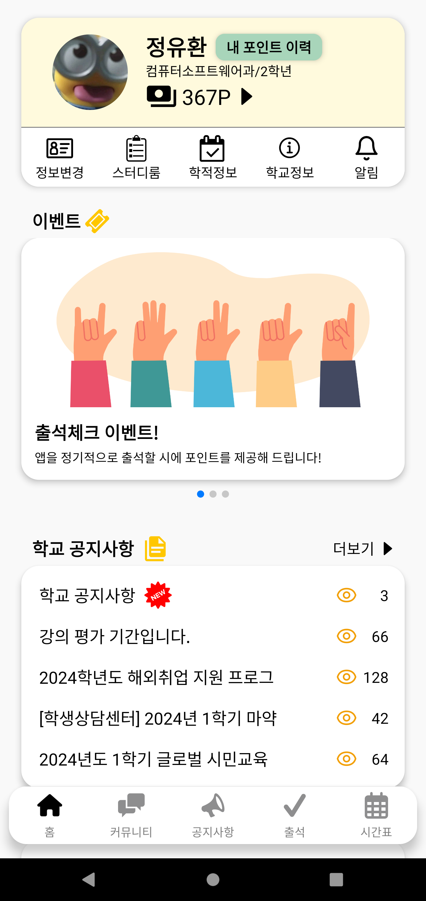
  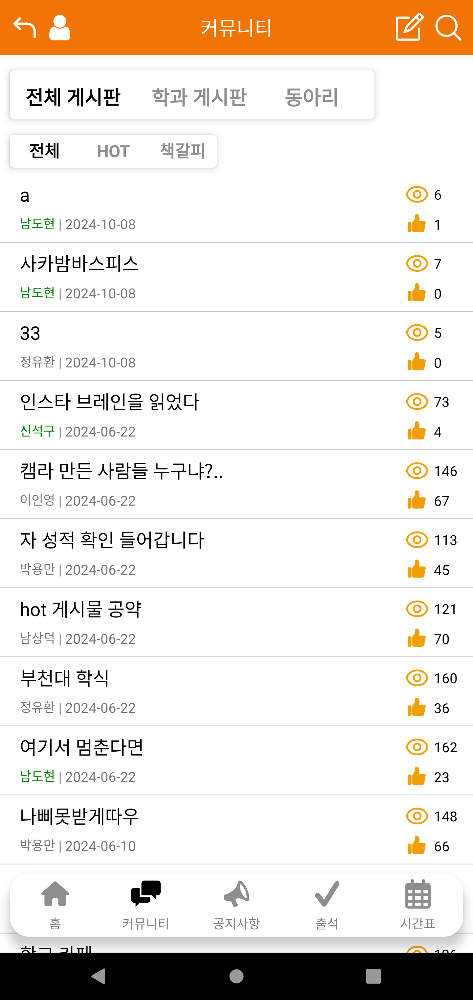
  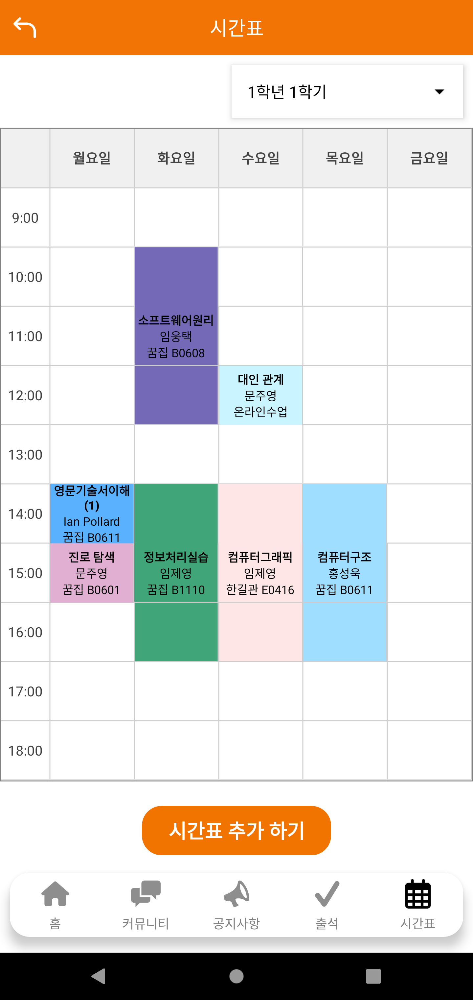
  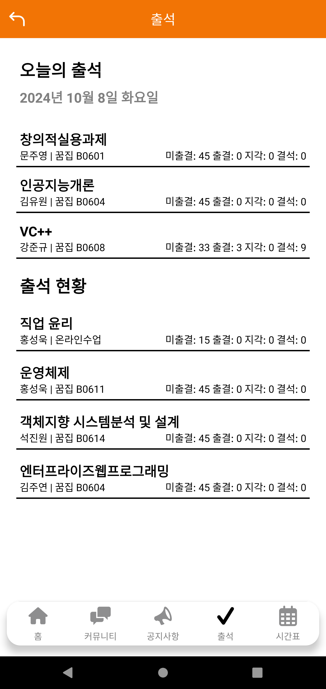
  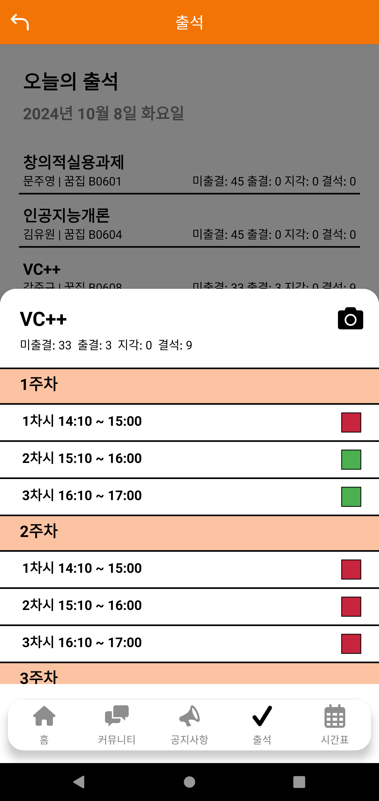
  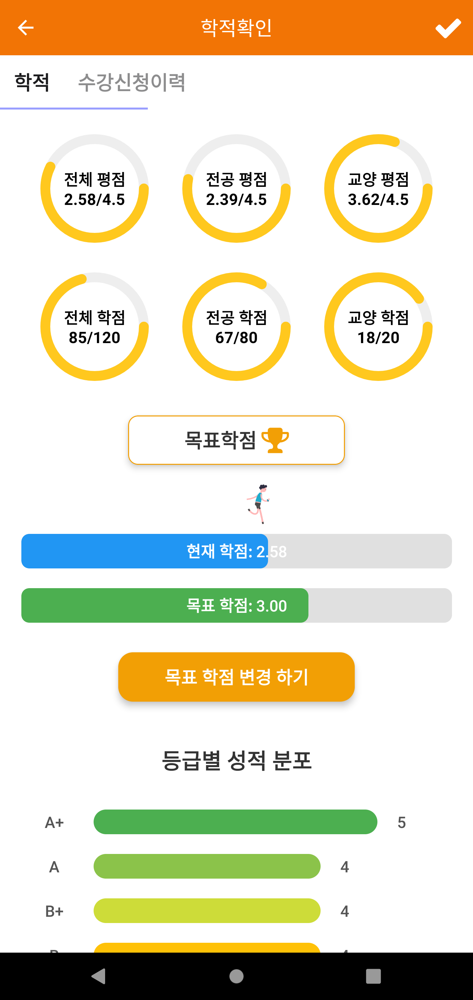
  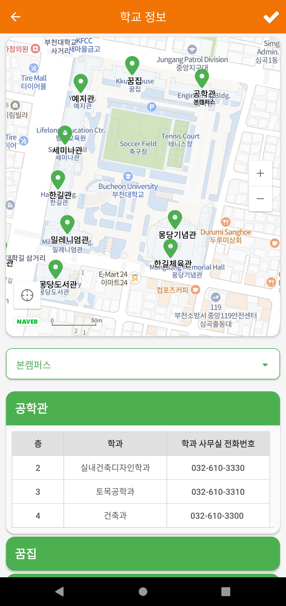
  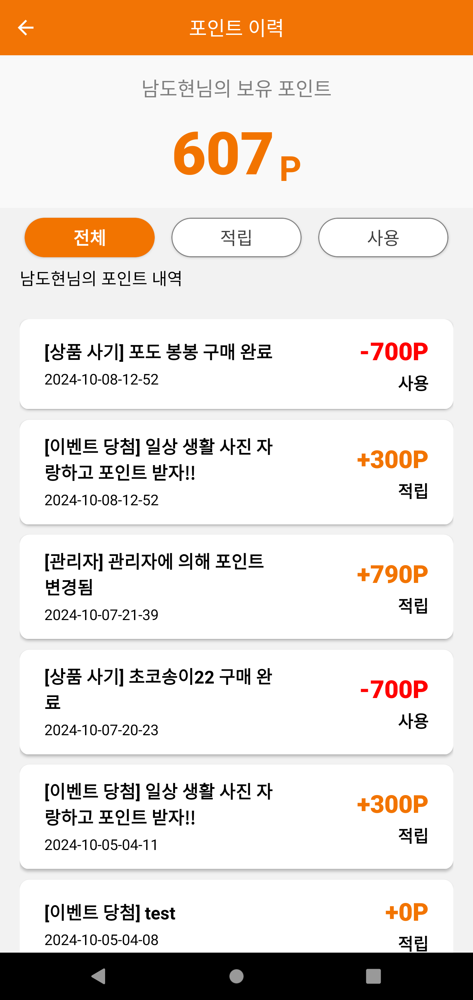
  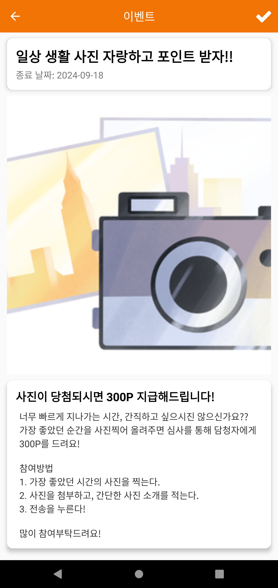
  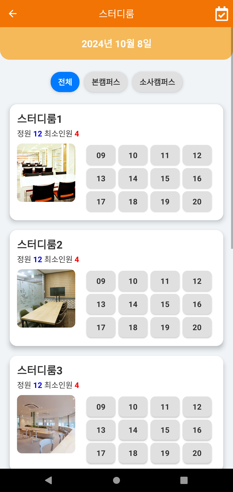
  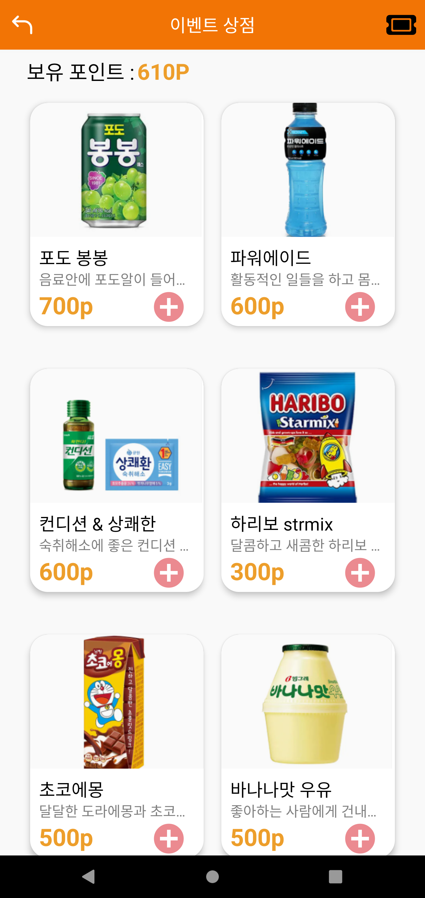
  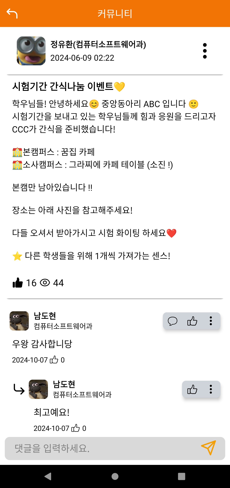
</div>

---

## 📁 디렉토리 구조

```
Mobile/
├── App/
│   ├── App.tsx                  # 앱 진입점
│   ├── config.js                # 환경 설정
│   ├── db.js                    # DB 연동 설정
│   ├── server.js                # 서버 연동 로직
│   ├── types/
│   │   └── type.tsx             # 공통 타입 정의
│   ├── assets/                  # 로고, 뱃지, 애니메이션(Lottie) 등 정적 리소스
│   ├── images/                  # 업로드된 사용자 콘텐츠 이미지 (게시글, 이벤트 등)
│   │
│   ├── navigation/
│   │   ├── StackNavigator.tsx       # 전체 스택 네비게이션
│   │   ├── BottomTabNavigator.tsx   # 하단 탭 네비게이션
│   │   └── TopTabNavigator.tsx      # 상단 탭 네비게이션
│   │
│   ├── screens/
│   │   ├── LoginScreens/            # 로그인 · 회원가입 · 검색 · 약관동의
│   │   ├── MainScreen.tsx           # 홈 화면
│   │   ├── AttendanceScreens/       # QR 출석 · 풀스크린 카메라
│   │   ├── TimetableScreen.tsx      # 시간표 관리
│   │   ├── CardScreens/             # 학적정보 · 학교정보 · 스터디룸 · 개인정보
│   │   │   └── AcademicScreens/     # 학적상태 · 학사정보
│   │   ├── CommunityScreens/        # 게시글 · 공지사항 · 동아리 · 북마크 (18개+)
│   │   ├── EventScreens/            # 이벤트 상점 · 출석체크 이벤트 · 친구코드 이벤트
│   │   └── PointHistoryScreen.tsx   # 포인트 내역
│   │
│   └── Admin_Screens/
│       ├── AdminMain.tsx            # 관리자 메인
│       ├── Navigation/
│       │   └── AdminStackNavigator.tsx
│       ├── Event_Screens/           # 이벤트 등록 · 수정 · 참가자 확인
│       ├── Product_Screens/         # 상품 등록 · 수정 · 확인
│       ├── Report_Screens/          # 신고 게시글 관리
│       ├── UserManagement.tsx       # 사용자(권한 · 경고) 관리
│       └── SchoolInfoChange.tsx     # 학교 정보 수정
│
├── components/
│   └── ui/gluestack-ui-provider/    # Gluestack UI 테마 프로바이더
│
├── android/                         # Android 네이티브 프로젝트
├── ios/                             # iOS 네이티브 프로젝트
└── __tests__/                       # 테스트 코드

Web/
└── src/
    ├── App.js                       # 웹 앱 진입점
    ├── HeaderPage/                  # 헤더 컴포넌트
    └── page/
        ├── Login.js                  # 로그인
        ├── Main.js                   # 메인
        ├── QrCheck.js                 # QR 체크
        ├── AuthContext.js             # 인증 컨텍스트
        └── config.js / server.js      # 설정 · 서버 연동
```

---
